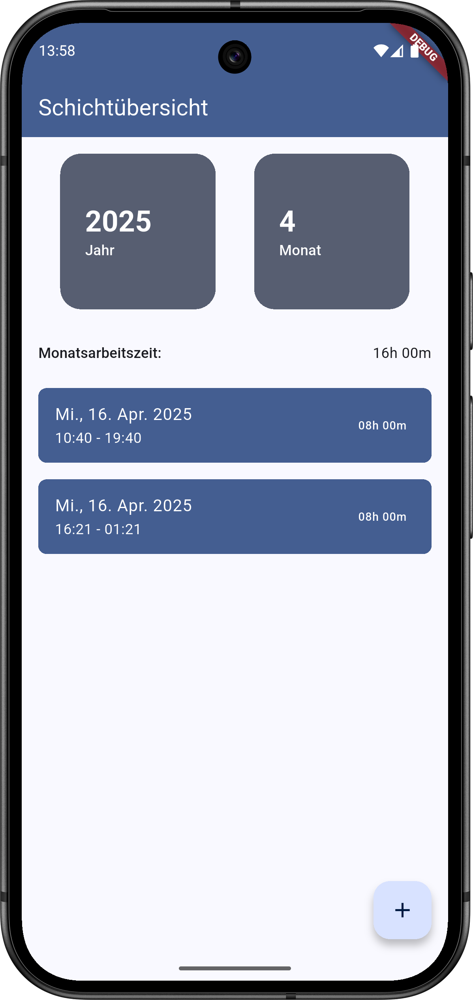

# arbeitszeit_calculator_flutter

App zur Arbeitszeiterfassung, implementiert mit Flutter

## Funktionen

- Schichten anlegen und verwalten
- Zusammenfassung aktuell ausgewählter Monat
- (TODO) Import / Export von und zu JSON
- (TODO) Import von Schichten aus iCal-Dateien
